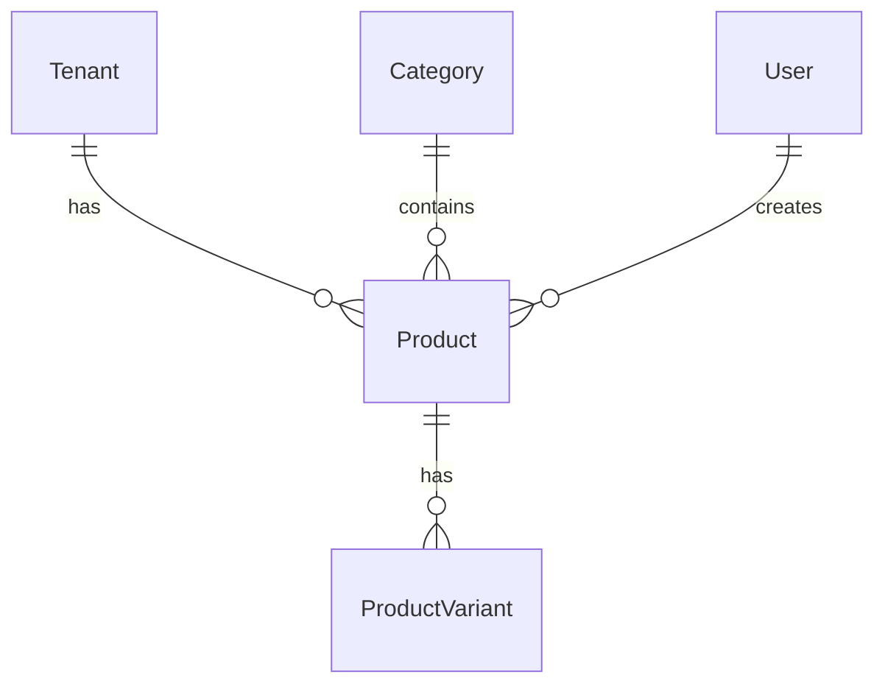

# Database Schema — {{FEATURE_NAME}}

> Template for `specs/<feature>/database-schema.md`. Schema-First: this file is written BEFORE any backend code.
> Prisma schema + migration follow this spec.

---

## 1. Entities

### 1.1 {{EntityName}}

| Column | Type | Nullable | Default | Constraints | Description |
|--------|------|----------|---------|-------------|-------------|
| id | UUID | No | `uuid()` | PK | Primary key |
| tenant_id | UUID | No | — | FK → tenants.id, NOT NULL, indexed | Tenant isolation |
| name | VARCHAR(100) | No | — | NOT NULL, unique per tenant+category | Product name |
| price | DECIMAL(10,2) | No | — | CHECK price > 0 | Price |
| category_id | UUID | No | — | FK → categories.id, indexed | Category |
| description | TEXT | Yes | NULL | max 1000 chars (app-level) | Description |
| image_url | VARCHAR(2048) | Yes | NULL | Valid URL (app-level) | Image |
| is_available | BOOLEAN | No | true | — | Availability |
| created_at | TIMESTAMPTZ | No | now() | — | Created timestamp |
| updated_at | TIMESTAMPTZ | No | — | auto-updated | Updated timestamp |
| deleted_at | TIMESTAMPTZ | Yes | NULL | — | Soft delete |
| created_by | UUID | Yes | — | FK → users.id | Creator |
| updated_by | UUID | Yes | — | FK → users.id | Last updater |

**Indexes:**

| Index | Columns | Type | Purpose |
|-------|---------|------|---------|
| idx_{{table}}_tenant | tenant_id | B-tree | Tenant isolation (every query) |
| idx_{{table}}_tenant_deleted | tenant_id, deleted_at | B-tree | Filter active records |
| idx_{{table}}_category | category_id | B-tree | Join + filter by category |
| uq_{{table}}_tenant_category_name | tenant_id, category_id, name | Unique | Business rule: unique name per tenant+category |
| idx_{{table}}_tenant_available | tenant_id, is_available | B-tree | Filter by availability |

**Prisma Model:**

```prisma
model Product {
  id          String    @id @default(uuid()) @db.Uuid
  tenantId    String    @map("tenant_id") @db.Uuid
  name        String    @db.VarChar(100)
  price       Decimal   @db.Decimal(10, 2)
  categoryId  String    @map("category_id") @db.Uuid
  description String?   @db.Text
  imageUrl    String?   @map("image_url") @db.VarChar(2048)
  isAvailable Boolean   @default(true) @map("is_available")
  createdAt   DateTime  @default(now()) @map("created_at") @db.Timestamptz
  updatedAt   DateTime  @updatedAt @map("updated_at") @db.Timestamptz
  deletedAt   DateTime? @map("deleted_at") @db.Timestamptz
  createdBy   String?   @map("created_by") @db.Uuid
  updatedBy   String?   @map("updated_by") @db.Uuid

  tenant      Tenant    @relation(fields: [tenantId], references: [id], onDelete: Restrict)
  category    Category  @relation(fields: [categoryId], references: [id], onDelete: Restrict)
  createdByUser User?  @relation("ProductCreatedBy", fields: [createdBy], references: [id])
  updatedByUser User?  @relation("ProductUpdatedBy", fields: [updatedBy], references: [id])

  @@unique([tenantId, categoryId, name], name: "uq_products_tenant_category_name")
  @@index([tenantId], name: "idx_products_tenant")
  @@index([tenantId, deletedAt], name: "idx_products_tenant_deleted")
  @@index([categoryId], name: "idx_products_category")
  @@index([tenantId, isAvailable], name: "idx_products_tenant_available")
  @@map("products")
}
```

---

### 1.2 {{SecondEntity}} (repeat for each entity)

...

---

## 2. Relationships



| From | To | Type | FK | onDelete | Description |
|------|----|------|----|----------|-------------|
| Product.tenantId | Tenant.id | N:1 | tenant_id | Restrict | Every product belongs to a tenant |
| Product.categoryId | Category.id | N:1 | category_id | Restrict | Prevent deleting category with products |
| ProductVariant.productId | Product.id | N:1 | product_id | Cascade | Delete variants when product deleted |

---

## 3. Constraints & Business Rules

| Rule | Enforcement | Location |
|------|-------------|----------|
| Price > 0 | CHECK + DTO validation + domain invariant | DB + App + Domain |
| Name unique per tenant+category | UNIQUE index + domain check | DB + Domain |
| Soft delete only | deletedAt column + repository filter | DB + Repository |
| Tenant isolation | tenantId on every row + query filter | DB + Repository + Guard |

---

## 4. Migration Plan

**Migration name:** `add_{{feature}}_tables`

**Steps:**

1. Create tables in dependency order (parents first): Category → Product → ProductVariant
2. Add indexes
3. Add foreign keys
4. Verify with `npx prisma validate` + `npx prisma migrate dev`

**Rollback plan:** Drop tables in reverse order. Document data loss implications.

**Seed data (if needed):**

```typescript
// prisma/seed/{{feature}}.ts
// Idempotent — use upsert
await prisma.category.upsert({
  where: { id: seedCategoryId },
  update: {},
  create: { id: seedCategoryId, tenantId, name: 'Default', sortOrder: 0 },
});
```

---

## 5. Query Patterns & Index Justification

| Query | Frequency | Index Used |
|-------|-----------|------------|
| List products by tenant (paginated) | High | idx_products_tenant_deleted |
| Filter by category | High | idx_products_category |
| Filter by availability | Medium | idx_products_tenant_available |
| Search by name | Medium | Consider pg_trgm / full-text index if needed |
| Unique name check | On create/update | uq_products_tenant_category_name |

---

## 6. Checklist

- [ ] Every business table has id, tenantId, createdAt, updatedAt, deletedAt, createdBy, updatedBy
- [ ] PK is UUID
- [ ] tenantId indexed on every business table
- [ ] Soft delete via deletedAt
- [ ] Unique constraints correctly scoped to tenant
- [ ] Foreign keys with deliberate onDelete
- [ ] Indexes for every query pattern
- [ ] No business logic in DB (no triggers/procedures without ADR)
- [ ] Prisma model uses @map for snake_case
- [ ] Migration name follows convention
- [ ] Seed data idempotent (if applicable)
